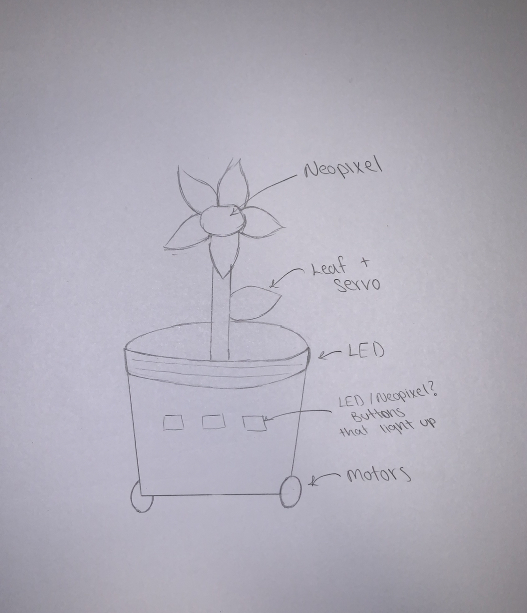
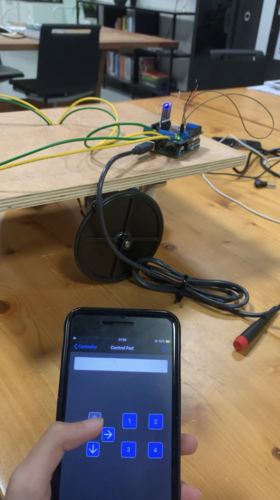
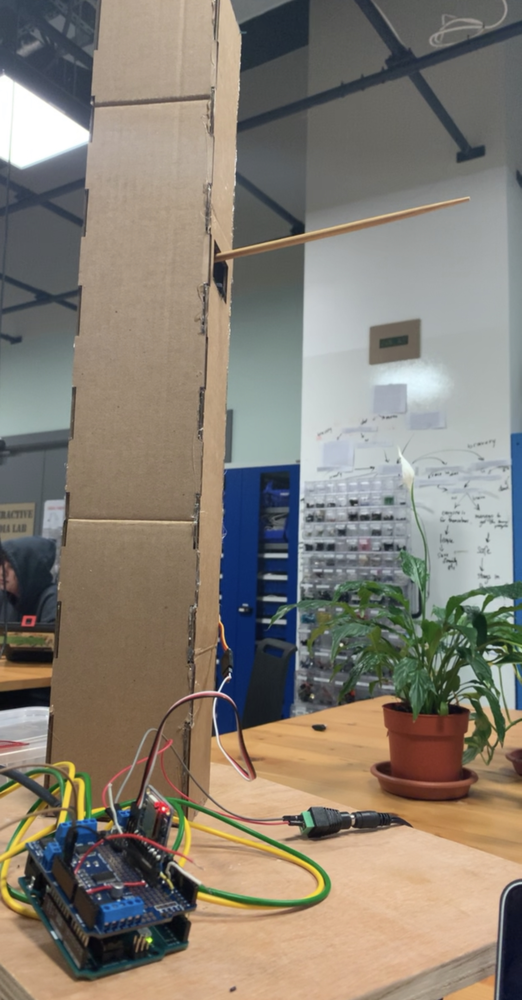
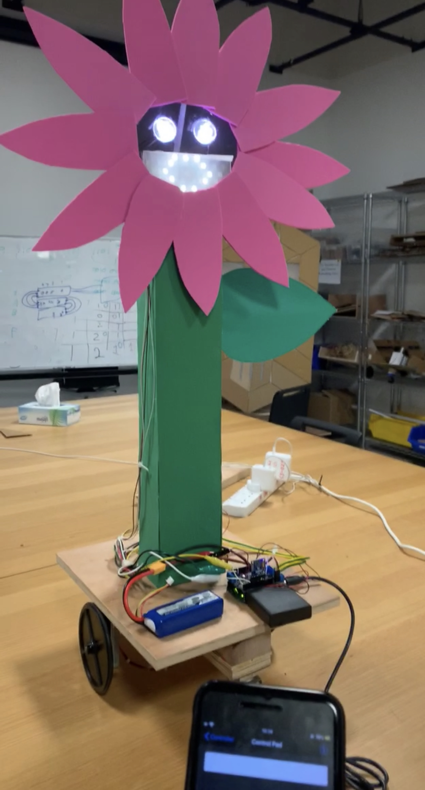

# Overall project concept and description

My [final project](https://drive.google.com/open?id=1uz7tgk99hdHKHJIrNHluxbeR6VsvlWnh) is about a plant which suddenly comes to life after a thunderstorm strikes. 
It gets very excited about being real and moving around. It goes around in circles and moves back and 
forth, and starts singing a song. Then it realizes that living alone is pointless. It bumps into another plants that looks
just like it but more mature. It starts inspecting it, and talking to it. It gets no response 
starts feeling very lonely and sad, and decides it doesn't want to be real anymore. It starts glitching 
then shuts down. The moment it does so, the other plants wakes up and says,“oh my dear son, what happened to
you."

# Progress Pictures
I started by drawing a sketch of how I imagined my robot to be.

I then built and programmed the base.

Then I built the stem, and connected and programmed the servo.

Then I added the face and petals, and covered the stem and leaf with green.

Finally I programmed the whole thing to work together.

# List of important parts
  1- Bluefruit BLE SPI Friend for phone control
  2- 2 DC Motors to drive around 
  3- 1 Servo motor for the leaf
  4- Neopixels strip for the face and around the pot
  5- 5V battery pack
  6- 22V lithium battery

# Problems:
  1- The servo stopped working
  
  I programmed the servos to move at different speeds and different ranges depending on the emotions of the plant.
  However, when I compiled the whole program the servos would not work. The best solution was to just not use the 
  servo. 
  
  
  2- Getting familiar with the parts 
  
  All the parts were new to me. I worked with the servos and neopixels a little onour midterm project, but everything
  else was new. I was slow, and I took my time to learn about those parts, ask for help, get familiar with them.
  I always gave myself more time than I believed I needed and never rushed myself with anything. It was a long,
  slow process which required good time management, but I learned a lot.
  
  
  3- Inability to work on the weekend 
  
  I am only on campus Monday through Thursday, but I leave Thursdays right after my class, which gives me only
  three days to work on my project per week. I had to organize my time really well so that I spend those full
  three days working on my robot, and also working on things that I dont need the lab for, such as the script
  and audio at home.
